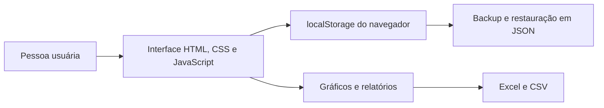

<h1 align="center">Inventário Escolar</h1>

  
  
  

<strong>Controle e diagnóstico de laptops e tablets escolares em uma única interface</strong>

Projeto pessoal de <a href="https://github.com/elizeuantonioq">Elizeu Antonio</a>

O Inventário Escolar surgiu de uma necessidade do trabalho de suporte técnico em escolas: registrar o estado de laptops e tablets, localizar equipamentos que precisam de reparo e preparar relatórios para a coordenação. A aplicação reúne o cadastro e a consulta em uma interface que funciona no navegador.

Esta versão usa HTML, CSS e JavaScript, sem servidor ou banco de dados. **Os registros ficam salvos apenas no `localStorage` do navegador em que foram cadastrados.** Para guardar uma cópia ou levar os dados a outro computador, use o backup em JSON disponível em cada módulo.

## O que você pode testar

- Cadastrar laptops de alunos, tablets e laptops de professores em painéis separados.
- Adicionar um equipamento por vez ou cadastrar vários números em lote, como `01-20, 25`.
- Registrar estado de conservação, marca quando aplicável e observações.
- Buscar, filtrar por estado, editar e excluir registros.
- Buscar equipamentos nos três painéis pela barra global (`Ctrl+K`) e alternar entre os temas claro e escuro.
- Consultar totais e gráficos de cada tipo de equipamento.
- Exportar os dados de cada painel para Excel (`.xlsx`) ou CSV e fazer backup ou restauração em JSON.

## Como funciona

O painel de alunos distingue bom estado, problemas de software, falta ou mau funcionamento de teclas e equipamentos quebrados. O de tablets usa os estados bom e quebrado. O de professores distingue bom estado, problemas de software ou lentidão e equipamentos quebrados ou que não ligam. Cada painel mantém seus próprios registros.

O cadastro em lote aceita números separados por vírgula, ponto e vírgula ou quebra de linha. Intervalos numéricos usam hífen, `a` ou `até`, por exemplo `01-20` ou `1 a 20`. Cada intervalo pode abranger até 201 números, contando as duas pontas.

## Executar localmente

1. Extraia o projeto e abra `index.html` em um navegador atualizado.
2. Escolha um dos três painéis na navegação superior.
3. Cadastre alguns equipamentos e teste a busca, os filtros e as exportações.

Não há instalação de dependências nem etapa de compilação. A página carrega Chart.js, ExcelJS, xlsx-js-style, Three.js, Font Awesome e fontes por CDNs; **é preciso ter conexão com a internet** para que esses recursos externos carreguem ao abrir o projeto localmente.

Os arquivos `tablets.html` e `professores.html` redirecionam para os respectivos painéis em `index.html`. A configuração em `vercel.json` também oferece as rotas `/tablets` e `/professores` quando o projeto é publicado na Vercel.

## Dados e limitações

Os dados não são sincronizados entre navegadores ou computadores. Limpar os dados do navegador, usar uma janela privada ou trocar de dispositivo pode deixar os registros indisponíveis. Exporte um backup JSON de **cada painel** antes de limpar o navegador ou mudar de máquina; a restauração substitui os dados daquele painel.

Não há autenticação nem armazenamento compartilhado. O projeto não inclui uma suíte automatizada de testes. Para uso coletivo ou armazenamento centralizado, seria necessário acrescentar uma API, um banco de dados e controle de acesso.
